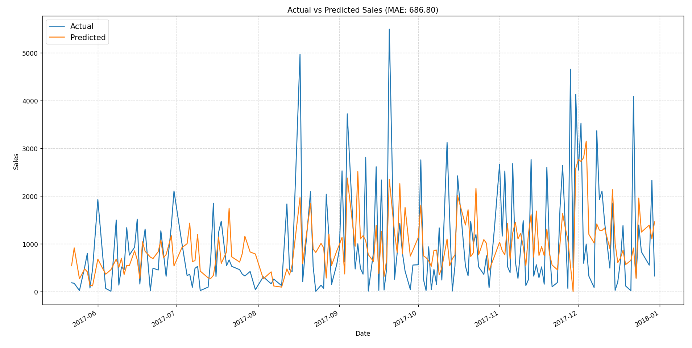

# 📊 Sales Forecasting using XGBoost

---

## 🚀 Problem Statement

The objective of this project is to forecast future sales using historical data.  
The dataset contains time-based sales records, and the challenge is to capture temporal patterns such as trends, seasonality, and fluctuations.

The goal is to build a machine learning model that minimizes prediction error (MAE) and provides reliable forecasts.

---
## 📌 Project Overview
This project focuses on **time series sales forecasting** using machine learning.  
The goal was to predict future sales based on historical patterns using feature engineering and advanced models.

---
## 💡 Key Insights

- Time-series problems require **lag-based features** rather than simple regression
- Basic models like Linear Regression and Random Forest failed to capture temporal dependencies (MAE > 700)
- XGBoost performed better due to its ability to model non-linear patterns
- Removing unnecessary features improved performance significantly
- Feature engineering (Lag + Rolling Mean) was the **key factor in reducing error**
- Final optimized MAE achieved: ~686
---
## ⚡ Challenges & Improvements

- Initial models gave high error (>700 MAE)
- Adding too many features sometimes worsened performance
- Identifying useful features required experimentation
- Lag features (Lag_1, Lag_7, Lag_14, Lag_30) improved results
- Hyperparameter tuning (n_estimators, max_depth) helped reduce MAE
- Learned importance of feature selection in time-series ML
---

## 🧠 Approach

### 1. Data Preprocessing
- Converted `Order Date` to datetime format  
- Sorted data chronologically  
- Aggregated daily sales  

---

### 2. Feature Engineering
Created meaningful time-series features:

- 📅 Date Features:
  - Year, Month, Day
  - DayOfWeek
  - Quarter
  - IsWeekend

- 🔁 Lag Features:
  - Lag_1 (previous day)
  - Lag_7 (last week same day)
  - Lag_14
  - Lag_30

- 📈 Rolling Features:
  - Rolling Mean (7 days)

---

### 3. Models Tried
| Model            | Result (MAE) |
|------------------|-------------|
| Linear Regression | >700        |
| Random Forest     | >700        |
| XGBoost           | ✅ **~686** |

👉 XGBoost performed best due to its ability to capture complex patterns.

---

## 🏆 Final Model
- **Model:** XGBoost Regressor  
- **MAE Score:** ~686  
- Optimized using:
  - n_estimators = 500  
  - max_depth = 6  
  - learning_rate = 0.05  

---

## 📊 Visualization
Actual vs Predicted sales comparison:

**

---

## 📁 Files Included
- `sales_forecasting_xgboost.py` → Main model code  
- `sales.csv` → Dataset  
- `Actual_vs_Predicted.png` → Model performance visualization

---

## ⚙️ How to Run

```bash
pip install pandas numpy matplotlib scikit-learn xgboost
python sales_forecasting_xgboost.py
```
## 👨‍💻 Author
**Shashwat Singh**  
B.Tech (3rd Year) | Data Analyst | Machine Learning Enthusiast  

---

## 🔗 Connect with Me
- LinkedIn: *((https://www.linkedin.com/in/shashwat-singh-aa83022a1/))*
- Email: shashwat3210dl@gmail.com 
